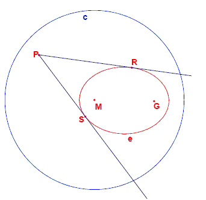
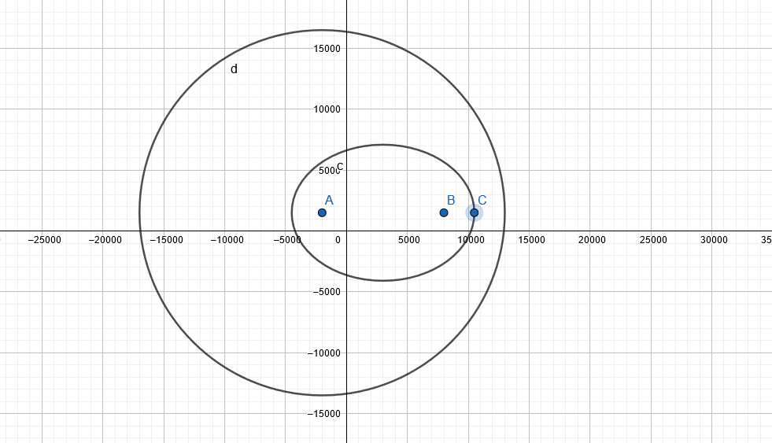
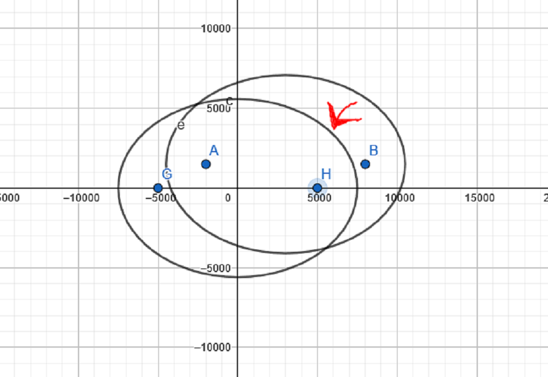
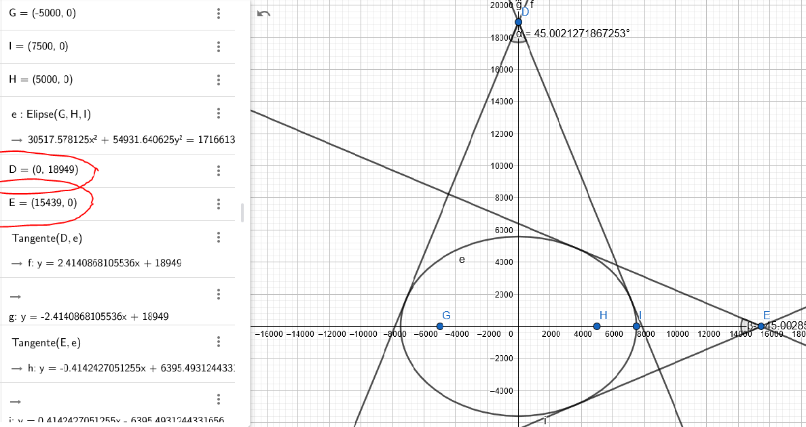

# Problema 246 ProjectEuler

O código e o arquivo pdf presentes no repositório apresentam a solução computacional para o problema [246](https://projecteuler.net/problem=246) disponível no site do [Project Euler](https://projecteuler.net/about) e a base matemática usada pra chegar a essa solução. 


## Problema

O problema resolvido foi o de número 246, que possuí um indice de dificuldade de 80%, cujo enunciado pode ser visto abaixo.

Problem 246
A definition for an ellipse is:
Given a circle c with centre M and radius r and a point G such that d(G,M)<r, the locus of the points that are equidistant from c and G form an ellipse. 

Given are the points M(-2000,1500) and G(8000,1500).
Given is also the circle c with centre M and radius 15000.
The locus of the points that are equidistant from G and c form an ellipse e.
From a point P outside e the two tangents t1 and t2 to the ellipse are drawn.
Let the points where t1 and t2 touch the ellipse be R and S. 




For how many lattice points P is angle RPS greater than 45 degrees?

## Solução

A solução detalhada pode ser encontrada em [Solução](calculos.pdf), porém falando brevemente sobre as etapas realizadas temos:
* Primeiro foi feita a descrição em fórmulas matemáticas das formas apresentadas



* Em seguida foi feita a mudança de cordenadas para centralizar a elipse e facilitar os cálculos e posteriormente a lógica da parte computacional



* Depois foram feitos manipulações algébricas para obter fórmulas que serão usadas posteriomente no programa em python para achar os pontos e verificar a validez
* Alem disso também foram cálculados os limites superiores em ambos os eixos para verificar os pontos ao longo dos eixos e otimizar a execução do programa 



## Fontes e Ferramentas utilizadas

A unica ferramenta necessária é o python, porém também foram usadas as ferramentas online GeoGebra E WolframAlpha
* [Python](https://www.python.org/) - A linguagem de programação usada.
* [GeoGebra](https://www.geogebra.org/?lang=pt) - Uma ferramenta utilizada para visualizar a geometria do problema.
* [WolframAlpha](https://www.wolframalpha.com/) - Uma ferramenta utilizada para simplificar, expandir e manipular equações.

Para solucionar o problema também foram usados conhecimentos e fórmulas disponíveis nas seguintes fontes:
* https://www.educamaisbrasil.com.br/enem/matematica/coeficiente-angular
* https://mundoeducacao.uol.com.br/matematica/elipse.htm
* https://www.w3schools.com/python/module_math.asp
* https://stackoverflow.com/questions/18583214/calculate-angle-of-triangle-python
* https://mundoeducacao.uol.com.br/matematica/angulo-formado-entre-duas-retas.htm
* https://pir2.forumeiros.com/t67218-as-equacoes-das-retas-tangente-a-elipse

## Como Usar

Para utilizar o programa basta ter python 3.9.5 instaladoe executar o arquivo .py a partir do terminal.

```crystal
python3 projecteuler246.py
```

## Autores

* **Luís Humberto Chaves Senno** - [betolhcs](https://github.com/betolhcs)


